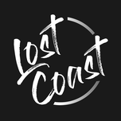

# Lost Coast Surf Tech
---
This is an breakdown of the current version of **Lost Coast Surf Tech** iOS App.

# User Interface
---
The current version of user interface was designed in Sketch. The file can be found in the root directory of the xcode project. Its name is **SurfTech_Design**.

The Sketch file contains 6 main sections:  

1. Greeting screens
2. Home screen
3. Analytics	
4. Community
5. Forecast
6. Profile and Setting

Each section contains connected storyboards that can easily be follow. The storyboards are also in their sequential order or grouped in a hierarchical order.

## 1. Greeting

The greeting screen is the very first screen that *greets* the users when they first open the app. The main point is to set the tone and language for the rest of the application.  

The screen provide the user the options of **Login** or **Sign up**.

#### A. Login

The users will use their registered email to log in. Upon success, the users will be segue to the home screen. If failed, there will be an error message modally display on the screen.

#### B. Sign up

The users will use an email and a password of their choice to sign up and register into the database. Upon success, the onboarding process will begin to complete the user's profile and ask for critical permissions.
If failed, there will also be an error message modally display on the screen. The message will be specific for the type of error (e.g. duplicate email, wrong password) 

  
#### Onboarding Process  
 
1. Date of birth, username, and full name
2. User profile image
3. Notification setting permission	
4. Location tracking permission
5. User agreement acknoledgement

If the users stop the onboarding process without completing it, the registeration is then considered as incomplete. Thus, they will be taken back to the onboarding process next time they log in. 

## 2. Home Screen
The home screen is fairly simple: It will provide the user the necessary and simple to digest information about their surf session.  

* Caught waves
* Average Distance
* Hardest Cutback
* Total Session Time
* Session Score

On this screen, if the user already has a device connected, the user only need to pull down to sync when the page is scrolled to the top. 

## 3. Analytics 

#### A. History  
	
This tab allows the user to look at their past session at a glance. Each cell in the table will contain date, time, and also a specific stat that the user want to highlight. In the mock up, we are using number of wave caught during session.  

#### B. Category Highlight

Using a drill down approach, each history cell can expand into categories highlight of the session. Categories such as distance traveled per wave, cutback power of each wave and how many wave the user caught are displayed with an accompanied session graph for a quick comparision. The idea is that the user will be able to see when they gained momentum or cooled down. 

#### C. Category Detail

To drill down even further, each category can be expanded into even further breakdown. For example, if the user click on wave caught cell, the system will give the user details on how high was the wave, when user caught the wave, where user caught the wave. All of those stats details are in large graphs format. to which the user can tap on them to review numeric details of the stat.

#### D. Records

This is a subtab of the main analytics tab. The record tab show the user each category that the system been keep track of. When the user tap on each category, it will bring up the user's record and achievement from their past surf sessions. 

## 4. Community
This section is reserved for the community aspect of the app. This section has not been implemented or design.

## 5. Forecast
Currently, forecast is not part of the app. The section is just here as an idea pad.

## 6. Profile and Settings
This is section is for the user to check their profile other than session's stats. The user can check out and change their profile description, images, and personal informations. 

The current implementation show that the user can find their friend list here. In the future, it is recommended to move the friend list to the community side to compartmentalize features. 

However, to make this section feels more personal, the user's list of earned medals can be found here.

In the setting tabs, the user can sign out, toggle app usage permissions, and pair with bluetooth devices.

# Architecture
---
The current version of the application is using **Firebase Firestore** for data storage. Pushing and pulling from Firebase can be quite expensive. To minimize this, the application is also using **Realm** for local database management. Any information that does not need to be updated often can be store locally to avoid constant pulling whenever user start the application. 

The following are the Cocoapod dependencies (API) for the application:

  - IQKeyboardManagerSwift
  - RealmSwift  
  - Firebase 
  - Firebase/Core
  - Firebase/Auth
  - Firebase/Database 
  - Firebase/Storage 
  - Firebase/Firestore  

## 1. Key API

#### IQKeyboardManagerSwift
Manage keyboard interaction with UI elements to avoid keyboard covering screen.

#### RealmSwift
Realm local database API for storing data locally.

#### Firebase
Firebase API for cloud storage/database

#### Firebase/Auth
Authentication API for Firebase.

#### Firebase/Firestore
Firebase Firestore API for Firestore cloud storage; work in conjunction with Firebase API.